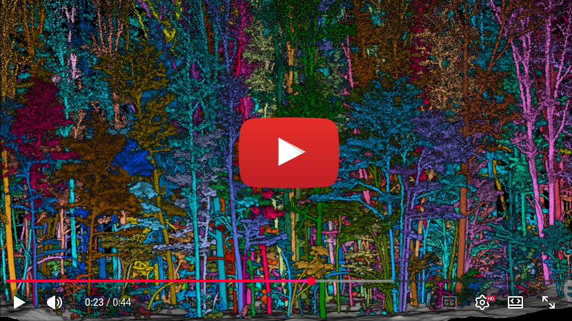

# Arbor  

[](LICENSE)

**From raw forest scans to thousands of QSMs on your laptop, in minutes.**

[📖 Book & Tutorial](https://r-lidar.github.io/arborBook/) · [🌐 r-lidar.com](https://www.r-lidar.com/)

Arbor is a production-grade C++ library for large-scale processing of forest mobile laser scanning (MLS) data, with an R package API. It takes you through the entire workflow: from initial ground classification to final QSM reconstruction, including wood/foliage semantic segmentation and individual tree instance segmentation.

It handles real-world, noisy data, leaf-on scans, automatically without requiring parameter tuning or manual intervention and can produce up to 1.000 QSMs per minute

<p align="center">
  <a href="https://youtu.be/uvsoBODrmpw" title="Arbor demo - Click to Watch!">
    
  </a>
  <br/>
  Click to view on Youtube
</p>

## Why Arbor?

- :zap: **Built to scale:** Process a quarter-hectare in 8-10 minutes. Compute roughly 700 QSMs per minute. All on a standard laptop.
- :triangular_ruler: **Consistent results out of the box:** Run your datasets through a clear, repeatable pipeline using default settings that just work.
- :book: **Well documented:** Explore step-by-step guides and hands-on examples in the [Arbor Book](https://r-lidar.github.io/arborBook/).
- :chart_with_upwards_trend: **Grounded in real data:** Validated on an extensive collection of real-world forest scans.

## Installation

```r
install.packages('arbor', repos = c('https://r-lidar.r-universe.dev', 'https://cloud.r-project.org'))
```

## Learn more

The **[Arbor Book](https://r-lidar.github.io/arborBook/)** is a complete, illustrated guide to the full pipeline with example datasets you can download and run right now.

Minimal Reproducible Example:

```r
las <- readTLS("forest.laz", select = "xyz", filter = "-keep_random_fraction 0.25")
las <- hybrid_homogeneization(las)
las <- segment_ground(las)
las <- wood_likelihood(las)
las <- segment_semantic(las)
see <- find_seeds(las)
las <- segment_instance(las, see)
qsf <- qsf(las)
plot(qsf, pal = "chocolate4")
```
